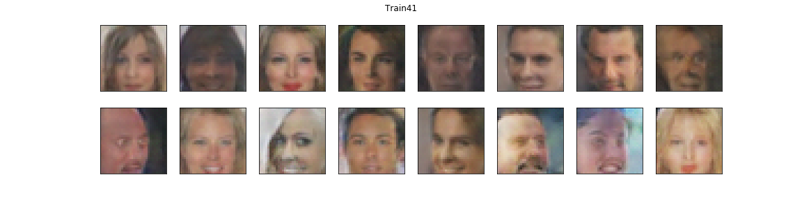
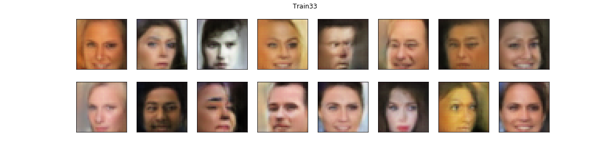

[//]: # (Image References)

[image1]: image_sets/train_41_Train41,%20n_epochs%20=%201.png
[image2]: image_sets/train_41_Train41,%20n_epochs%20=%2010.png
[image3]: image_sets/train_41_Train41,%20n_epochs%20=%2020.png
[image4]: image_sets/train_41_Train41,%20n_epochs%20=%2030.png
[image5]: image_sets/train_41_Train41,%20n_epochs%20=%2040.png
[image6]: image_sets/train_41_Train41,%20n_epochs%20=%2050.png
[image7]: image_sets/train_41_Train41,%20n_epochs%20=%2060.png
[image8]: image_sets/train_41_Train41,%20n_epochs%20=%2070.png
[image9]: image_sets/train_41_Train41,%20n_epochs%20=%2080.png
[image10]: image_sets/train_41_Train41,%20n_epochs%20=%2090.png
[image11]: image_sets/train_41_Train41,%20n_epochs%20=%20100.png


# Face Generation with DCGANs

In this project, I define and train a DCGAN on a dataset of faces. The goal is to get a generator network to generate new images of faces that look as realistic as possible.

In more detail, I am using Deep Convolutional Generative Adversarial Networks (DCGANs) to generate new fake images. The project is broken down into a series of tasks from loading in data to defining and training adversarial networks. At the end of the notebook, I provide a visualization of the generated images.
The generated samples look like fairly realistic faces with small amounts of noise.

I am using the [CelebFaces Attributes Dataset (CelebA)](http://mmlab.ie.cuhk.edu.hk/projects/CelebA.html) to train your adversarial networks. Each of the CelebA images has been cropped to remove parts of the image that don't include a face, then resized down to 64x64x3 NumPy images. The total number of images used for the Discriminator training is 10674. Some sample data is show below.

### Original images
 Original images

In the images below you can look at some examples of generated fake images:
### Generated fake images
 Generated fake images

This is a project of the Udacity Nanodegree program 'Deep Learning'. Please check this [link](https://www.udacity.com/course/deep-learning-nanodegree--nd101) for more information.

The code is written in PyTorch. If you are interested in the specific coding steps open the Jupyter Notebook *dlnd_face_generation.ipynb*. A description to *open/execute* the file is provided in the Getting Started section.


## Getting Started

These instructions will get you a copy of the project up and running on your local machine for development and testing purposes.

### Installing (via pip)

- To run this script you will need to use a Terminal (Mac OS) or Command Line Interface (e.g. Git Bash on Windows [git](https://git-scm.com/)), if you don't have it already.
- If you are unfamiliar with Command Line coding check the free [Shell Workshop](https://www.udacity.com/course/shell-workshop--ud206) lesson at Udacity.

Next, clone this repository by opening a terminal and typing the following commands:

```
$ cd $HOME  # or any other development directory you prefer
$ git clone https://github.com/ddhartma/Face-Generation-with-DCGANs.git
$ cd ...
```
A Python installation is needed. Python 3 is already preinstalled on many systems nowadays. You can check which version you have by typing the following command (you may need to replace python3 with python):

```
$ python3 --version  # for Python 3
```
A Python 3.5 version or above should be fine. If you don't have Python 3, you can just download it from [python.org](https://www.python.org/downloads/).

You need to install several scientific Python libraries that are necessary for this project, in particular NumPy, Matplotlib, Pandas, Jupyter Notebook, Torch and Torchvision. For this, you can either use Python's integrated packaging system, pip, or you may prefer to use your system's own packaging system (if available, e.g. on Linux, or on MacOSX when using MacPorts or Homebrew). The advantage of using pip is that it is easy to create multiple isolated Python environments with different libraries and different library versions (e.g. one environment for each project). The advantage of using your system's packaging system is that there is less risk of having conflicts between your Python libraries and your system's other packages. Since I have many projects with different library requirements, I prefer to use pip with isolated environments.

These are the commands you need to type in a terminal if you want to use pip to install the required libraries. Note: in all the following commands, if you chose to use Python 2 rather than Python 3, you must replace pip3 with pip, and python3 with python.

First you need to make sure you have the latest version of pip installed:

```
$ python3 -m pip install --user --upgrade pip
```
The ```--user``` option will install the latest version of pip only for the current user. If you prefer to install it system wide (i.e. for all users), you must have administrator rights (e.g. use sudo python3 instead of python3 on Linux), and you should remove the ```--user``` option. The same is true of the command below that uses the ```--user``` option.

Next, you can optionally create an isolated environment. This is recommended as it makes it possible to have a different environment for each project (e.g. one for this project), with potentially very different libraries, and different versions:

```
$ python3 -m pip install --user --upgrade virtualenv
$ python3 -m virtualenv -p `which python3` env
```

This creates a new directory called env in the current directory, containing an isolated Python environment based on Python 3. If you installed multiple versions of Python 3 on your system, you can replace ```which python3``` with the path to the Python executable you prefer to use.

Now you must activate this environment. You will need to run this command every time you want to use this environment.

```
$ source ./env/bin/activate
```

On Windows, the command is slightly different:

```
$ .\env\Scripts\activate
```

Next, use pip to install the required python packages. If you are not using virtualenv, you should add the --user option (alternatively you could install the libraries system-wide, but this will probably require administrator rights, e.g. using sudo pip3 instead of pip3 on Linux).

```
$ python3 -m pip install --upgrade -r requirements.txt
```

Great! You're all set, you just need to start Jupyter now.

## Running the tests

The following files were used for this project:

- dlnd_face_generation.ipynb
- problem_unittests.py
- workspace_utils.py
- Data for the SDiscriminator Training is stored in *processed_celeba_small/celeba/...*
- requirements.txt

In order to run the Jupyter Notebook *dlnd_face_generation.ipynb* use the Terminal/CLI and write

```
jupyter notebook dlnd_face_generation.ipynb
```

For further help regarding Jupyter Notebook check [Jupyter-ReadTheDocs](https://jupyter.readthedocs.io/en/latest/index.html)


### Hyperparameters
The DCGAN training success depends strongly on the right choice of hyperparameters. If the network isn't getting the desired results, tweak these parameters and/or the layers.
Hence, set and train the neural network with the following parameters:

- Set **batch_size** --- to the batch size
- Set **img_size** --- image size for the Discriminator input and the Generator output
- Set **deconv-layers** --- number of deconvolutional layers for the Generator
- Set **conv-layers** --- number of convolutional layers for the Discriminator
- Set **d_conv_dime** --- input depth of the Discriminator
- Set **g_conv_dim** --- output depth of the Generator
- Set **z_size** --- inputs to the generator are vectors of length z_size
- Set **beta1** --- the exponential decay rate for the first moment
- Set **beta2** --- the exponential decay rate for the second-moment
- Set **dropout** --- additional Dropout layers (not used)
- Set **n_epochs** --- number of epochs


In the following section the parameter tuning is appended, which was investigated in separated training runs.
### Parameter: n_epochs

Parameters          | 1st Train-Run | 2nd Train-Run | 3rd Train-Run | 4th Train-Run | 5th Train-Run | 6th Train-Run |
----------          | ------------- | ------------- | ------------- | ------------- | ------------- | ------------- |
batch_size          |   128         |   128         |   128         |   128         |   128         |   128         |
img_size            |   32          |   32          |   32          |   32          |   32          |   32          |
deconv-layers       |   3           |   3           |   3           |   3           |   3           |   3           |
conv-layers         |   3           |   3           |   3           |   3           |   3           |   3           |
d_conv_dim          |   32          |   32          |   32          |   32          |   32          |   32          |
g_conv_dim          |   32          |   32          |   32          |   32          |   32          |   32          |
z_size              |   100         |   100         |   100         |   100         |   100         |   100         |
lr                  |   0.001       |   0.001       |   0.001       |   0.001       |   0.001       |   0.001       |  
beta1               |   0.5         |   0.5         |   0.5         |   0.5         |   0.5         |   0.5         |
beta2               |   0.999       |   0.999       |   0.999       |   0.999       |   0.999       |   0.999       |
dropout             |   no          |   no          |   no          |   no          |   no          |   no          |
**n_epochs**        |   `1`         |   `10`        |   `50`        |   `100`       |   `500`       |   `1000`      |

##### n_epochs = 1
![image1]

##### n_epochs = 10
![image2]

##### n_epochs = 20
![image3]

##### n_epochs = 30
![image4]

##### n_epochs = 40
![image5]

##### n_epochs = 50
![image6]

##### n_epochs = 60
![image7]

##### n_epochs = 70
![image8]

##### n_epochs = 80
![image9]

##### n_epochs = 90
![image10]

##### n_epochs = 100
![image11]


#### Result for parameter n_epochs:
Best value setting for the number of epochs extends to the range 20...70. Lower epoch values lead to underfitting, higher epoch values tend to pronounced noisy behavior of the discriminator loss. In both regimes the generated face images are blurred.

### Parameter: number of conv-layers and deconv-layers
One model with number of conv-layers=deconv_layers=3 was compared to another model with number of conv-layers=deconv_layers=4. For simplification of the model pictures below, ReLU activation and batch normalization layers were neglected.


Parameters          | 4th Train-Run | 8th Train-Run |
----------          | ------------- | ------------- |
batch_size          |   128         |   128         |  
img_size            |   32          |   32          |
deconv-layers       |   3           |   4           |
conv-layers         |   3           |   4           |
d_conv_dim          |   32          |   32          |
g_conv_dim          |   32          |   32          |
z_size              |   100         |   100         |  
lr                  |   0.001       |   0.001       |  
beta1               |   0.5         |   0.5         |
beta2               |   0.999       |   0.999       |
dropout             |   no          |   no          |
n_epochs            |   100         |   100         |

##### conv-layers=3 and deconv-layers=3


##### conv-layers=4 and deconv-layers=4


#### Result for parameter number of conv-layers and deconv-layers:
There is no clear trend with regard to the number of conv-layers and deconv-layers. Corresponding images for conv-layers=3 and deconv-layers=3 look similar to conv-layers=4 and deconv-layers=4. However, the trend of losses is slightly better for conv-layers=4 and deconv-layers=4, higher (positive) loss for the Generator and slightly lower loss for the Discriminator. In the following conv-layers=4 and deconv-layers=4 will be used for further parameter studies.

### Parameter: conv_dim

Parameters          | 8th Train-Run | 11th Train-Run  | 12th Train-Run  | 13th Train-Run |
----------          | ------------- | -------------   | -------------   | -------------  |
batch_size          |   128         |   128           |   128           |  128           |   
img_size            |   32          |   32            |   32            |   32           |
deconv-layers       |   4           |   4             |   4             |   4            |
conv-layers         |   4           |   4             |   4             |   4            |
**d_conv_dim**      |   `32`        |   `64`          |   `128`         |  `256`         |   
**g_conv_dim**      |   `32`        |   `64`          |   `128`         |  `256`         |
z_size              |   100         |   100           |   100           |   100          |   
lr                  |   0.001       |   0.001         |   0.001         |   0.001        |  
beta1               |   0.5         |   0.5           |   0.5           |   0.5          |
beta2               |   0.999       |   0.999         |   0.999         |   0.999        |
dropout             |   no          |   no            |   no            |   no           |
n_epochs            |   100         |   100           |   100           |   100          |

##### d_conv_dim=32 and g_conv_dim=32


##### d_conv_dim=64 and g_conv_dim=64


##### d_conv_dim=128 and g_conv_dim=128


##### d_conv_dim=256 and g_conv_dim=256


#### Result for parameter conv_dim:
With a higher conv_dim for the Generator and the Discriminator the resolution of feature details is getting higher. For example, eyes are better resolved with a conv_dim=256 than with a conv_dim=32. However, even a conv_dim of 64 leads to convincing results.


### Parameter: lr @ beta1=0.1

Parameters          | 27th Train-Run| 28th Train-Run| 29th Train-Run |
----------          | ------------- | ------------- | -------------  |
batch_size          |   32          |   32          |  32            |
img_size            |   32          |   32          |  32            |
deconv-layers       |   4           |   4           |  4             |
conv-layers         |   4           |   4           |  4             |
d_conv_dim          |   64          |   64          |  64            |
g_conv_dim          |   64          |   64          |  64            |
z_size              |   100         |   100         |  100           |
lr                  |   0.001       |   0.0005      |  0.0002        |   
beta1               |   0.1         |   0.1         |  0.1           |
beta2               |   0.999       |   0.999       |  0.999         |
dropout             |   yes         |   yes         |  yes           |
n_epochs            |   100         |   100         |  100           |

### Parameter: lr @ beta1=0.2

Parameters          | 37th Train-Run| 39th Train-Run| 26th Train-Run |
----------          | ------------- | ------------- | -------------  |
batch_size          |   32          |   32          |  32            |
img_size            |   32          |   32          |  32            |
deconv-layers       |   4           |   4           |  4             |
conv-layers         |   4           |   4           |  4             |
d_conv_dim          |   64          |   64          |  64            |
g_conv_dim          |   64          |   64          |  64            |
z_size              |   100         |   100         |  100           |
lr                  |   0.001       |   0.0005      |  0.0002        |   
beta1               |   0.2         |   0.2         |  0.2           |
beta2               |   0.999       |   0.999       |  0.999         |
dropout             |   yes         |   yes         |  yes           |
n_epochs            |   100         |   100         |  100           |  

##### lr=0.001 @ beta=0.1


##### lr=0.0005 @ beta=0.1


##### lr=0.0002 @ beta=0.1


##### lr=0.001 @ beta=0.2


##### lr=0.0005 @ beta=0.2


##### lr=0.0002 @ beta=0.2


#### Result for parameter lr:
Learning rates in the range between 0.01 and 0.0001 were tested. In all cases the GAN is able to learn and generated fake images of faces are successfully constructed. However, a learning rate of lr=0.0002 leads to best results. As the choice of batch_size has to be done with an appropriate learning rate, learning rates were also studied in combination with different values for <a href='#Parameter_batch_size'>batch_size</a> as well as for <a href='#Parameter_beta1'>beta1</a>.

### Parameter: batch_size @ lr=0.0002

Parameters          | 24th Train-Run| 26th Train-Run| 36th Train-Run|
----------          | ------------- | ------------- | ------------- |
batch_size          |   16          |   32          |   64          |
img_size            |   32          |   32          |   32          |
deconv-layers       |   4           |   4           |   4           |
conv-layers         |   4           |   4           |   4           |  
d_conv_dim          |   64          |   64          |   64          |
g_conv_dim          |   64          |   64          |   64          |  
z_size              |   100         |   100         |   100         |
lr                  |   0.0002      |   0.0002      |   0.0002      |  
beta1               |   0.2         |   0.2         |   0.2         |
beta2               |   0.999       |   0.999       |   0.999       |
dropout             |   yes         |   yes         |   yes         |
n_epochs            |   100         |   100         |   100         |  

### Parameter: batch_size @ lr=0.0005

Parameters          | 38th Train-Run| 39th Train-Run| 40th Train-Run|
----------          | ------------- | ------------- | ------------- |
batch_size          |   16          |   32          |   64          |
img_size            |   32          |   32          |   32          |
deconv-layers       |   4           |   4           |   4           |
conv-layers         |   4           |   4           |   4           |  
d_conv_dim          |   64          |   64          |   64          |
g_conv_dim          |   64          |   64          |   64          |  
z_size              |   100         |   100         |   100         |
lr                  |   0.0005      |   0.0005      |   0.0005      |  
beta1               |   0.2         |   0.2         |   0.2         |
beta2               |   0.999       |   0.999       |   0.999       |
dropout             |   yes         |   yes         |   yes         |
n_epochs            |   100         |   100         |   100         |   

##### batch_size=16 @ lr=0.0002


##### batch_size=32 @ lr=0.0002


##### batch_size=64 @ lr=0.0002


##### batch_size=16 @ lr=0.0005


##### batch_size=32 @ lr=0.0005


##### batch_size=64 @ lr=0.0005


#### Result for batch_size:
The value range for the batch_size was chosen between 16 and 512. A larger batch_size has a positive effect on the computational boost. However, if the batch_size is getting too high the feature resolution is getting worse (more blurred). If the batch_size is too small, then the gradients will become more unstable and would need to reduce the learning rate. So batch_size and learning rate lr are linked. The noisy loss for small batch_sizes can be used to overcome local minima during training. If one use a bigger batch_size, then the gradients will become less noisy (this can be clearly seen in the results above) but it will take longer to converge. Therefore a batch_size of 32 has been chosen. Up to a batch_size of 512 no out-of-memory errors were observed.


<a id='Parameter_beta1'></a>
### Parameter: beta1

Parameters          | 29th Train-Run| 26th Train-Run| 31th Train-Run |
----------          | ------------- | ------------- | -------------  |
batch_size          |   32          |   32          |  32            |
img_size            |   32          |   32          |  32            |
deconv-layers       |   4           |   4           |  4             |
conv-layers         |   4           |   4           |  4             |
d_conv_dim          |   64          |   64          |  64            |
g_conv_dim          |   64          |   64          |  64            |
z_size              |   100         |   100         |  100           |
lr                  |   0.0002      |   0.0002      |  0.0002        |   
beta1               |   0.1         |   0.2         |  0.3           |
beta2               |   0.999       |   0.999       |  0.999         |
dropout             |   yes         |   yes         |  yes           |
n_epochs            |   100         |   100         |  100           |


##### beta=0.1


##### beta=0.2


##### beta=0.3


#### Result for beta1:
Values for beta1 were investigated in the range between 0.1 to 0.5. It was found out that beta1 values in the range between 0.1 to 0.3 have shown to get best results for generated images.


### Parameter: Dropout config
Parameters          | 41/32...35th Train-Run|
----------          | ------------- |
batch_size          |   32          |
img_size            |   32          |
deconv-layers       |   4           |
conv-layers         |   4           |
d_conv_dim          |   64          |
g_conv_dim          |   64          |
z_size              |   100         |
lr                  |   0.0002      |
beta1               |   0.2         |
beta2               |   0.999       |
dropout             |   no/yes      |
n_epochs            |   100         |

In separate Training runs different settings of Dropout layers were tested.
In Train41 no dropout layers were impmented whereas in Train32...35 different dropout probabilities of 0.5 and 0.2 and number of dropout layers were studied. For simplification of the model pictures below, ReLU activation and batch normalization layers are not shown but were implemented in the corresponding training runs.


##### Train41


##### Train32


##### Train33


##### Train34


##### Train35


#### Result for Dropout config:
It turns out that applying droping layers can lead to a certain enhancement of the quality of generated images. Best dropout results were achieved for Train32 (and Train33), i.e. applying a dropout layer with a dropout probability of 0.5 (0.2) after each convolutional for the discriminator and each deconvolutional layer for the generator. However, even without any dropout layers the results are not bad (Train41).

### Final hyperparameter setting
The following table shows the best-of setting of the investigated parameter tuning.

Parameters          | 41th Train-Run|
----------          | ------------- |
batch_size          |   32          |  
img_size            |   32          |  
deconv-layers       |   4           |  
conv-layers         |   4           |  
d_conv_dim          |   64          |    
g_conv_dim          |   64          |  
z_size              |   100         |  
lr                  |   0.0002      |   
beta1               |   0.2         |   
beta2               |   0.999       |     
dropout             |   no          |   
n_epochs            |   70          |


##### Train41


## Reasons for the chosen final hyperparameter setting:

### <a href='#Parameter_n_epochs'>Parameter: n_epochs</a>
n_epochs was varied between 1 and 500. Best value setting for the number of epochs extends to the range 20...70. Lower epoch values lead to underfitting, higher epoch values tend to pronounced noisy behavior of the discriminator loss. In both regimes the generated face images are blurred.

### <a href='#Parameter_number_conv_deconv_layers'>Parameter: number of conv-layers and deconv-layers</a>
Two models were constructed: one with 3 and another one with 4 conv and deconv layers for the discriminator and generator, respectively. Corresponding images for conv-layers=deconv-layers=3 look similar to conv-layers=deconv-layers=4. Hence, a clear trend is hard to distinguish in these examples. However, the trend of losses is slightly better for conv-layers=deconv-layers=4 than for conv-layers=deconv-layers=3, i.e. the loss for the Generator is higher and the loss for the Discriminator is slightly lower. Therefore conv-layers=4 and deconv-layers=4 have been used for further parameter studies.

### <a href='#Parameter_conv_dim'>Parameter: conv_dim</a>
The conv_dim value was investigated in the range between 32 and 256. With a higher conv_dim for the Generator and the Discriminator the resolution of feature details is getting higher. For example, eyes are better resolved with a conv_dim=256 than with a conv_dim=32. However, even a conv_dim of 64 leads to convincing results.

### <a href='#Parameter_lr'>Parameter: lr</a>
Learning rates in the range between 0.01 and 0.0001 were tested. In all cases the GAN is able to learn and generated fake images of faces are successfully constructed. However, a learning rate of lr=0.0002 leads to best results. As the choice of batch_size has to be done with an appropriate learning rate, learning rates were also studied in combination with different values for <a href='#Parameter_batch_size'>batch_size</a> as well as for <a href='#Parameter_beta1'>beta1</a>.

### <a href='#Parameter_batch_size'>Parameter: batch_size</a>
The value range for the batch_size was chosen between 16 and 512. A larger batch_size has a positive effect on the computational boost. However, if the batch_size is getting too high the feature resolution is getting worse (more blurred). If the batch_size is too small, then the gradients will become more unstable and would need to reduce the learning rate. So batch_size and learning rate lr are linked. The noisy loss for small batch_sizes can be used to overcome local minima during training. If one use a bigger batch_size, then the gradients will become less noisy (this can be clearly seen in the results above) but it will take longer to converge. Therefore a batch_size of 32 has been chosen. Up to a batch_size of 512 no out-of-memory errors were observed.

### <a href='#Parameter_beta1'>Parameter: beta1</a>
Values for beta1 were investigated in the range between 0.1 to 0.5. It was found out that beta1 values in the range between 0.1 to 0.3 have shown to get best results for generated images.

### <a href='#Parameter_dropout'>Parameter: Dropout config</a>
It turns out that applying droping layers can lead to a certain enhancement of the quality of generated images. Best dropout results were achieved for Train32 (and Train33), i.e. applying a dropout layer with a dropout probability of 0.5 (0.2) after each convolutional for the discriminator and each deconvolutional layer for the generator. However, even without any dropout layers the results are not bad (Train41).

### Further improvements:
- To overcome the issue of a biased dataset (celebrity faces that are mostly white): one could add more images of non-white celebrity faces to get a more balanced dataset in the end.

- The model size is limited by the number of conv-layers and deconv-layers which was set to 4 in maximum. Higher values were not tested so far. Increasing the model size could especially enhance the feature extraction of the Discriminator. The adversarial Generator is then forced to produce images with better feature resolution.

- A further increase of the conv_dim could lead to better results. However, this would significantly increase the training time.

- The dataset images are 64x64x3 NumPy images. In the get_dataloader function I resized the images down to 32x32x3. This is the image size for the Discriminator input and the size of the Generator output. This resolution of the generated images is noisy. If one would keep width=64 and height=64 the images could resemble more the original ones. However, this would also increase the training duration.

- Regarding the optimizer strategy: For the Discriminator as well as for the Generator the same type of optimizer (Adam) was chosen with a learning rate down to 0.0001. A combination of different optimizer like SGD for the Discriminator and Adam for the Generator as proposed by [Soumith](https://github.com/soumith/ganhacks) has not been tested yet.


## Acknowledgments
* This is a project of the Udacity Nanodegree program 'Deep Learning'. Please check this [link](https://www.udacity.com/course/deep-learning-nanodegree--nd101) for more information
* README was inspired by [PurpleBooth](https://gist.github.com/PurpleBooth/109311bb0361f32d87a2)
* For some inspiration about [Spectral_Normalization with GANs](https://github.com/christiancosgrove/pytorch-spectral-normalization-gan/blob/master/model_resnet.py)
